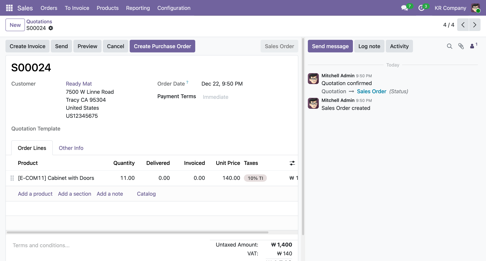
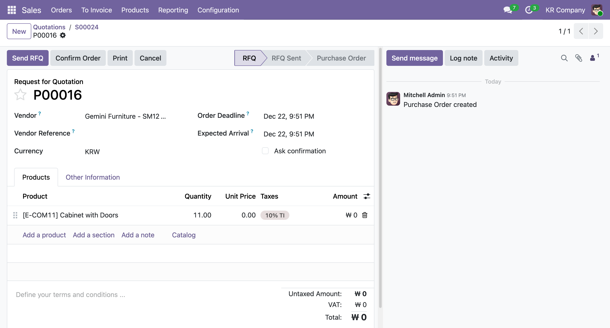

# Odoo Custom Module Exercise

Customizing Odoo ERP Modules for functionalities.

## Requirements

- [x] 1. On the Sales Order record, be able to create a Purchase order that uses the same product and quantity as the Sales Order
- [ ] 2. Purchase Order seems to have one to one relationship to sales order, but cannot infer the DB details from the purchase order. It makes sense, but for now we can just have the button hidden once there are at least one Purchase Order for Sales Order.
- [ ] 3. Vendor on the created Purchase Record is left null (overwrite default Odoo ORM behavior for requiring Vendor as a field)
- [ ] 4. (Bonus) Add Smart Buttons to navigate between the Sales and Purchase Orders

## How to Run

1. Make sure Odoo 19.0 is installed
2. add odoo.conf in the root of the Odoo directory
3. git clone this repo
4. rename the repo to a custom module wrapper (like `custom_addon`)
5. in the odoo.conf add the addon

example of odoo.conf (make sure other db configs are present, but add the addons_path, or add the custom module directory to the addons_path config.)

```
[options]
addons_path = {PATH_TO_ODOO}/addons, {PATH_TO_ODOO}/custom_addons
```

make sure the addons_path includes the original addons which should be `addons`, as well as `custom_addons`

## Screenshots of the Workflow

### 1. Create Purchase Order Button on a Sales Order Record


- Button named

### 2. Purchase Order Created with same Product and Quantity


- The Purchase Order Record Price is defaulted to 0
- The Purchase Order Record Vendor is defaulted based on product info or fallback

### 3. (Bonus) Smart Buttons to Navigate between Sales Order and Purchase Order

- Button only appears if there is a Purchase Order tied to the Sales Order (or vice versa)
