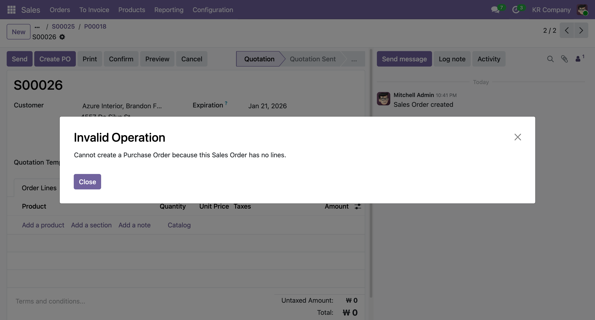
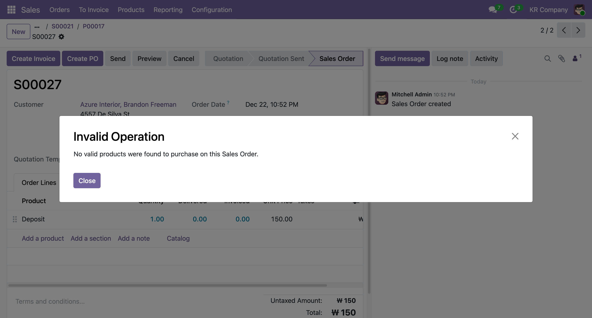
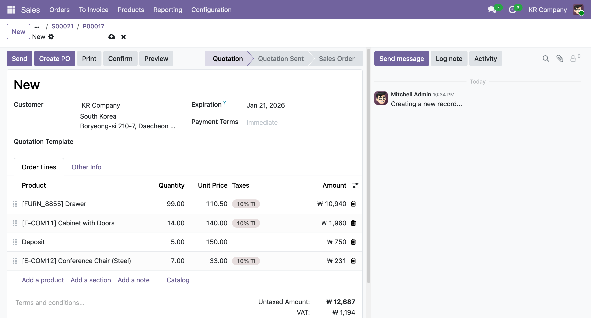
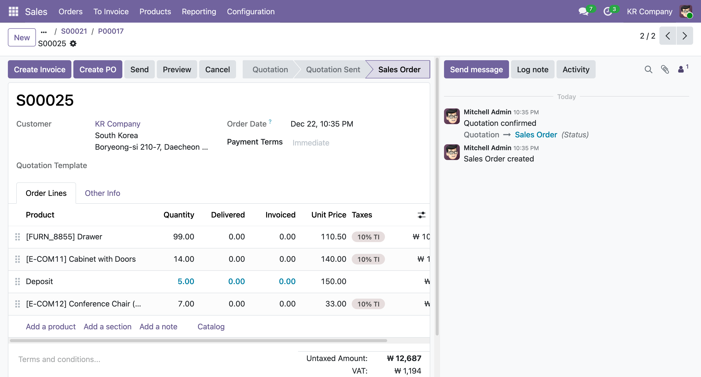
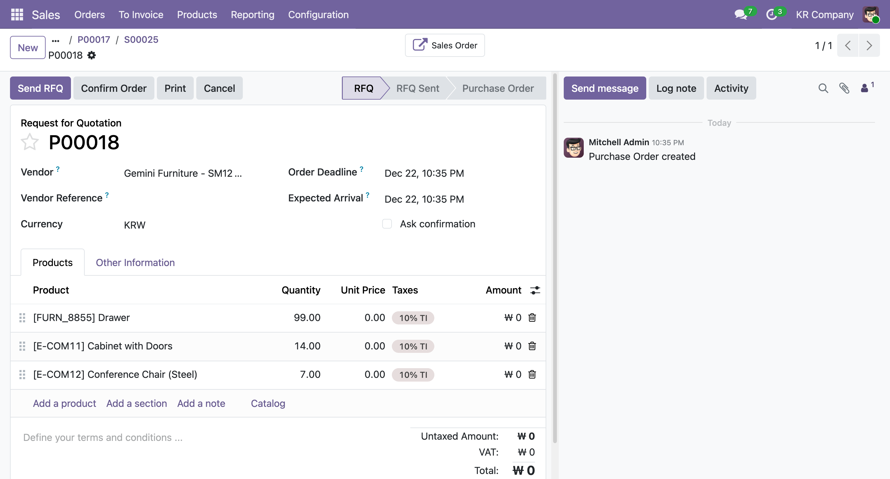
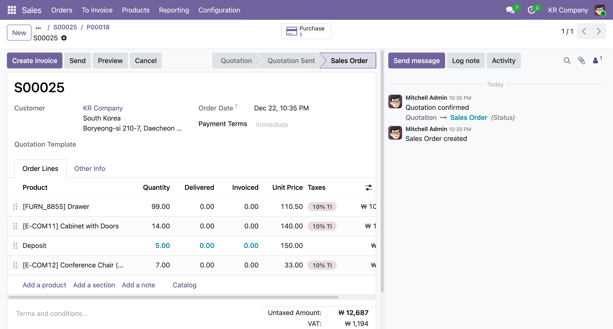
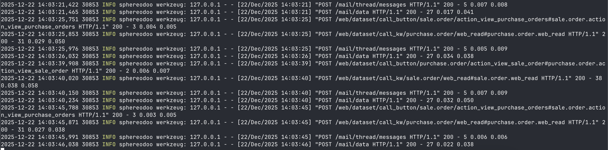
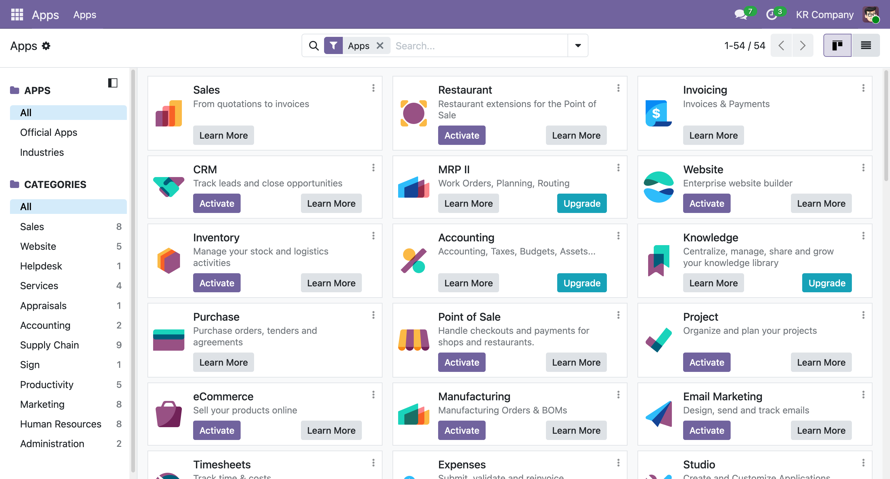
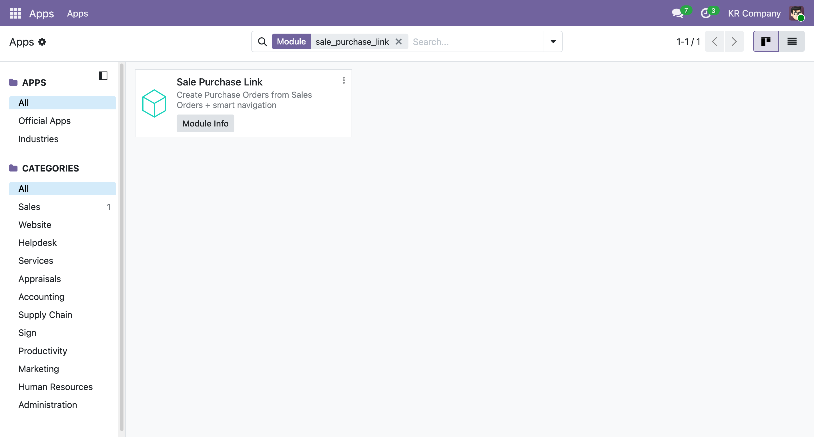

# Odoo Sale-Purchase Link Module

Creates Purchase Orders directly from Sales Orders with smart navigation buttons and comprehensive validation.

## Features

### Main Functionality
- Create PO from SO with same products and quantities
- Hide "Create PO" button after first PO is created
- Edge case validation (null lines, deposits, multi-items)

### Bonus
- Smart buttons for bidirectional SO <-> PO navigation

## Module Overview

This custom module extends Odoo's Sales app to enable one-click Purchase Order creation from Sales Orders. After a PO is created, the button is hidden and a smart button appears to navigate directly between linked records. The module validates all edge cases including null line items and deposit products.

## Repository Structure

```
custom_addons/
├── README.md                      # This file
├── assets/                        # Screenshots and documentation images
└── sale_purchase_link/            # Main module
    ├── __init__.py
    ├── __manifest__.py
    ├── models/
    │   ├── __init__.py
    │   ├── sale_order.py
    │   └── purchase_order.py
    └── views/
        ├── sale_order_views.xml
        └── purchase_order_views.xml
```

## Screenshots of the Workflow Confirmation

### 0. Basic Validations



- disallow faulty data input by checking on Sales order line entry
- also checks for edge case of invalid order lines for the purchase order (deposit)

### 1. Create Purchase Order Button on a Sales Order Record



- "Create PO" button appears grouped with the other primary buttons
- test with multi-item Sales Order lines, including a valid Sales Order line (deposit) that is simulatneously invalid for Purchase Order line.

### 2. Purchase Order Created with same Product and Quantity


- The Purchase Order Record Price is defaulted to 0
- The Purchase Order Record Vendor is defaulted based on business logic using product info or fallback
- Redirected to the PO page upon creation
- Once the PO is created, Smart Button appears for SO <-> PO Navigation (Sales Order Button)
- Can no longer see the "Create PO" button on Sales Order record.

### 3. (Bonus) Smart Buttons to Navigate between Sales Order and Purchase Order


- Button only appears if there is a Purchase Order tied to the Sales Order (or vice versa)
- From the Sales Order Record, can navigate to PO using "Purchase" button (default behavior, but the full custom logic is in place in case we want to replace it)
- From the Purchase Order Record, can navigate to SO using "Sales Order" button (custom smart button implementation.)


- Calls for the smart button navigation as it appears on the server side.


## System Requirements

- Odoo 19.0 (Community or Enterprise Edition)
- Sales app (sale) installed and enabled
- Purchase app (purchase) installed and enabled
- PostgreSQL database
- Python 3.10 or higher

## Installation Steps

### Step 1: Clone the Repository

Clone the repository into your Odoo custom addons directory:

```bash
cd /path/to/odoo/custom_addons
git clone git@github.com:seungkilee-cs/odoo-custom-module-exercise.git sale_purchase_link
```

or, you can just download the [repository](https://github.com/seungkilee-cs/odoo-custom-module-exercise) and extract only the `sale_purchase_link` to copy over to your custom_addons directory.

Your final directory structure should look like:

```
/path/to/odoo/
├── odoo-bin
├── addons/                 # Core Odoo modules
├── custom_addons/
│   ├── sale_purchase_link/ # <- Module installed here
│   ├── assets/
│   └── README.md
└── odoo.conf
```

### Step 2: Configure odoo.conf

If your custom addon directory is not included, ddit your Odoo configuration file to include the custom_addons path. Add or update the addons_path setting:

```
[options]
addons_path = /path/to/odoo/addons,/path/to/odoo/custom_addons
db_host = HOSTNAME
db_port = DBPORT
db_name = DBNAME
```

Replace the paths with your actual Odoo installation paths. The addons_path should include both the core addons directory and your custom_addons directory, separated by commas.

### Step 3: Restart Odoo Server

```bash
./odoo-bin -c odoo.conf
```

Wait for Odoo to fully start. You should see "server ready" in the logs.

### Step 4: Update Apps List

1. Open Odoo in your web browser (typically http://localhost:8069)
2. Log in with admin credentials
3. Navigate to Apps menu (top left)
4. Click "Update Apps List" button
5. Wait for the update to complete

### Step 5: Install the Module

1. In the Apps menu, remove the "Apps" filter (search for all modules)

2. Search for "sale_purchase_link" in the search box
3. Click on the module when it appears
4. Click the "Install" button


The module will be installed and you should see "Module installed" confirmation message.

### Alternative: Install via Command Line

Instead of using the web interface, you can install the module directly with the upgrade flag:

```bash
./odoo-bin -c odoo.conf -u sale_purchase_link
```

This will install the module and upgrade it if needed, then exit. Use this for automated deployments.

### Functional Testing Steps

1. Log in to Odoo as a user with Sales permissions
2. Navigate to Sales > Orders
3. Create a new Sales Order
4. Add at least one product line with quantity and unit price
5. Confirm the Sales Order
6. You should see a "Create Purchase Order" button in the header
7. Click the button to create a Purchase Order
8. After the first PO is created, the button becomes hidden
9. A "Purchase Order" smart button appears to navigate to the created PO

## Usage Guide

### Creating a Purchase Order from Sales Order

1. Open an existing or create a new Sales Order in draft or confirmed state
2. Locate the "Create Purchase Order" button in the form header
3. The button is visible only if:
   - Sales Order status is draft or sale (confirmed)
   - No Purchase Order has been created from this SO yet
4. Click the button to automatically create a PO with:
   - Same products and quantities as the SO
   - Vendor determined by product supplier data
   - All SO line items transferred to PO line items
5. A notification confirms successful PO creation
6. The "Create PO" button disappears from the SO
7. A "Purchase Order" smart button appears to navigate to the new PO

### Edge Cases Handled

The module includes validation and handling for:

- Null line items: Invalid SO lines are skipped
- Deposit products: Deposit items are excluded from PO creation
- Multi-item orders: All valid items are included in the PO
- No supplier: Items without supplier defaults are handled gracefully
- Duplicate PO: Once a PO is created, the button is hidden to prevent duplicates

### Smart Navigation

- From Sales Order: Click "Purchase" smart button to open linked PO (default module behavior)
- From Purchase Order: Click "Sales Order" smart button to navigate back
- Smart buttons only appear when a link exists between documents
